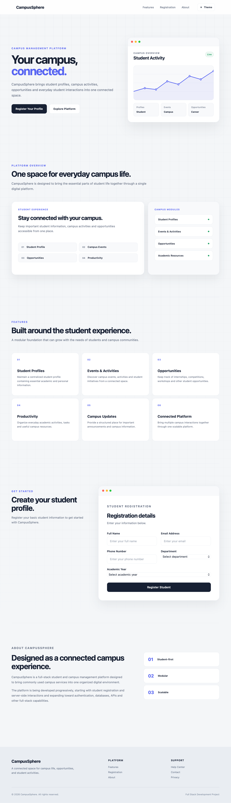
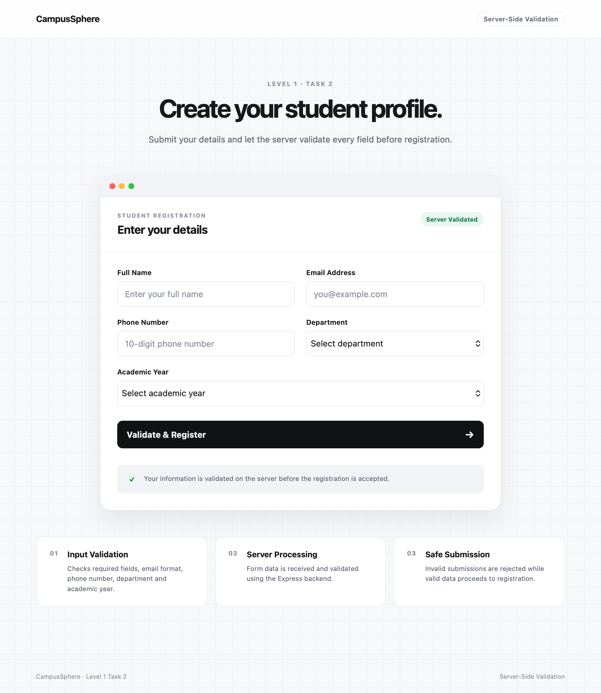
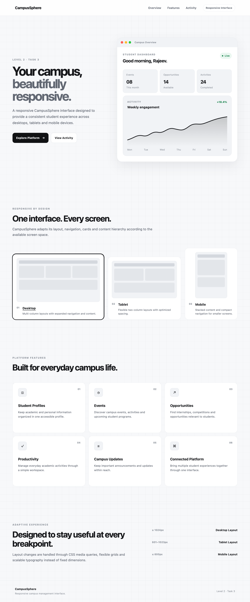
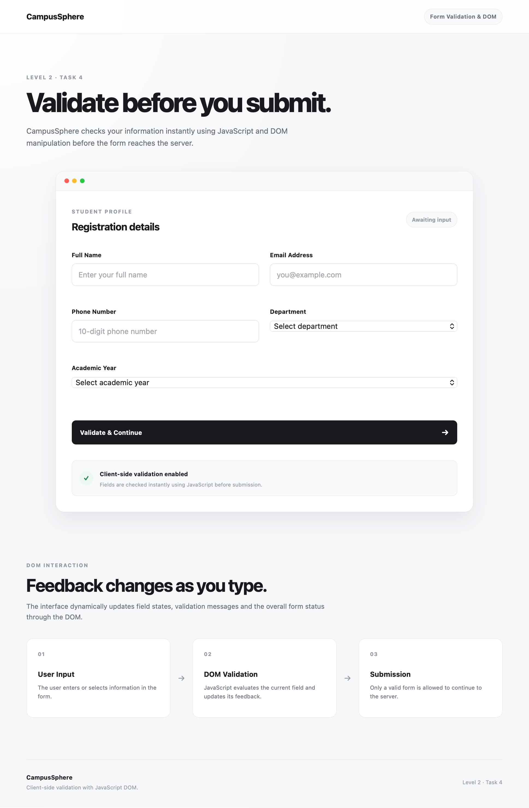
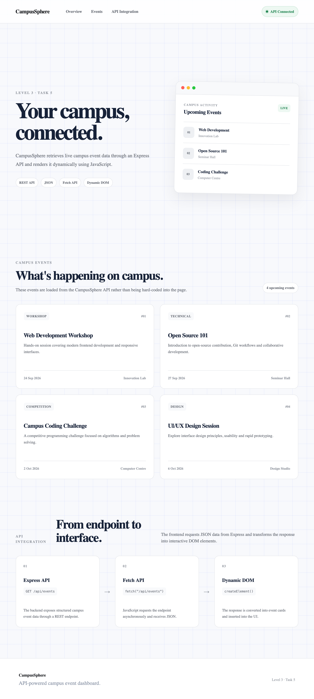

# CampusSphere — Full-Stack Student & Campus Management Platform

<p align="center">
  <strong>A progressive full-stack web development project completed during the Cognifyz Technologies Full Stack Development Internship.</strong>
</p>

<p align="center">
  <a href="https://github.com/raJEEv02kr/CampusSphere">
    
  </a>
  
  
  
</p>

---

## Table of Contents

- [Project Overview](#project-overview)
- [Internship Context](#internship-context)
- [Project Objectives](#project-objectives)
- [Project Highlights](#project-highlights)
- [Technology Stack](#technology-stack)
- [Project Architecture](#project-architecture)
- [Repository Structure](#repository-structure)
- [Task-Wise Documentation](#task-wise-documentation)
  - [Task 1 — HTML Server Interaction](#task-1--html-server-interaction)
  - [Task 2 — Server-Side Validation](#task-2--server-side-validation)
  - [Task 3 — CSS Responsive Design](#task-3--css-responsive-design)
  - [Task 4 — Form Validation and DOM Manipulation](#task-4--form-validation-and-dom-manipulation)
  - [Task 5 — API Integration](#task-5--api-integration)
  - [Task 6 — Database and Authentication](#task-6--database-and-authentication)
- [Application Workflow](#application-workflow)
- [Task-Wise Ports](#task-wise-ports)
- [Installation and Setup](#installation-and-setup)
- [Environment Variables](#environment-variables)
- [Running the Project](#running-the-project)
- [Authentication and Security](#authentication-and-security)
- [Database Design](#database-design)
- [Testing and Verification](#testing-and-verification)
- [Screenshots](#screenshots)
- [Video Demonstrations](#video-demonstrations)
- [Internship Report](#internship-report)
- [Learning Outcomes](#learning-outcomes)
- [Future Improvements](#future-improvements)
- [Project Limitations](#project-limitations)
- [Author](#author)
- [Acknowledgements](#acknowledgements)
- [License](#license)

---

## Project Overview

**CampusSphere** is a progressive full-stack web development project created as part of the Cognifyz Technologies Full Stack Development Internship.

The project demonstrates the development of a student-oriented campus management platform, beginning with basic HTML and server interaction and gradually progressing toward server-side validation, responsive design, client-side form validation, API integration, database connectivity, and authentication.

The implementation is organized into multiple internship tasks. Each task builds upon concepts introduced in earlier tasks and demonstrates a specific stage of full-stack application development.

The final advanced task introduces:

- User registration and login
- MongoDB Atlas database integration
- Mongoose data modeling
- Password hashing using bcryptjs
- JSON Web Token-based authentication
- HTTP-only authentication cookies
- Protected dashboard access
- Logout functionality

The project is structured to support learning, experimentation, documentation, and progressive development of full-stack web application concepts.

---

## Internship Context

| Field | Details |
|---|---|
| Internship Organization | Cognifyz Technologies |
| Internship Domain | Full Stack Development |
| Project Name | CampusSphere |
| Repository Name | CampusSphere |
| Development Environment | Visual Studio Code |
| Primary Operating System | macOS |
| Repository Platform | GitHub |
| Database | MongoDB Atlas |
| Backend Runtime | Node.js |
| Final Advanced Task Port | 3005 |

### Repository

GitHub Repository:

[https://github.com/raJEEv02kr/CampusSphere](https://github.com/raJEEv02kr/CampusSphere)

---

## Project Objectives

The primary objectives of CampusSphere are:

1. Understand the fundamentals of full-stack web development.
2. Develop web applications using HTML, CSS, and JavaScript.
3. Learn how frontend forms communicate with backend servers.
4. Implement server-side and client-side validation.
5. Create responsive user interfaces.
6. Work with REST-style API requests and responses.
7. Integrate external or backend API functionality into a web application.
8. Connect a Node.js application to MongoDB Atlas.
9. Implement user registration and login functionality.
10. Apply password hashing and token-based authentication.
11. Protect authenticated routes using middleware.
12. Organize a multi-task project using a maintainable directory structure.
13. Use Git and GitHub for version control and project submission.

---

## Project Highlights

- Progressive development from beginner to advanced full-stack concepts.
- Separate directories for each internship task.
- Express-based backend implementation.
- Server-rendered pages using EJS in the advanced authentication task.
- Responsive frontend styling.
- Client-side form interaction and validation.
- Backend request handling and validation.
- MongoDB Atlas integration.
- Mongoose-based user model.
- Password hashing using bcryptjs.
- JWT-based authentication.
- HTTP-only authentication cookie.
- Protected dashboard route.
- Logout route that clears the authentication cookie.
- GitHub-based source code management.

---

## Technology Stack

### Frontend Technologies

| Technology | Purpose |
|---|---|
| HTML5 | Page structure and form elements |
| CSS3 | Styling, layout, and responsive design |
| JavaScript | Client-side logic and interactivity |
| DOM API | Form interaction and validation |
| EJS | Server-side HTML rendering |
| Bootstrap | Used where applicable for responsive UI components |

### Backend Technologies

| Technology | Purpose |
|---|---|
| Node.js | JavaScript runtime for backend development |
| Express.js | Backend web framework |
| EJS | Server-side view rendering |
| REST-style endpoints | Request and response handling |
| Middleware | Request processing and authentication protection |

### Database and Authentication

| Technology | Purpose |
|---|---|
| MongoDB Atlas | Cloud database |
| MongoDB | Document-oriented database |
| Mongoose | MongoDB object modeling |
| bcryptjs | Password hashing |
| JSON Web Token | Authentication token generation and verification |
| dotenv | Environment variable management |
| cookie-parser | Reading authentication cookies |

### Development and Version Control

| Tool | Purpose |
|---|---|
| Visual Studio Code | Code editor |
| npm | Package and dependency management |
| Git | Version control |
| GitHub | Source code hosting |
| Safari Web Inspector | Browser debugging and cookie verification |

---

## Project Architecture

The project follows a progressive architecture.

```text
Frontend Interface
        |
        v
Client-Side JavaScript
        |
        v
Express Backend
        |
        v
Validation and Request Processing
        |
        v
API / Authentication Logic
        |
        v
MongoDB Atlas Database
```

The architecture becomes more advanced as the tasks progress.

### Beginner Level

Focuses on:

- HTML structure
- Form interaction
- Basic server communication
- Server-side form processing

### Intermediate Level

Focuses on:

- Responsive styling
- DOM manipulation
- Client-side validation
- JSON request handling

### Advanced Level

Focuses on:

- API integration
- Database connectivity
- User authentication
- Password hashing
- JWT verification
- Protected routes

---

## Repository Structure

The project is organized into three levels.

```text
CampusSphere/
│
├── .gitignore
├── README.md
│
├── Level-1-Beginner/
│   │
│   ├── Task-1-HTML-Server-Interaction/
│   │   └── ...
│   │
│   └── Task-2-Validation-Server-Side/
│       └── ...
│
├── Level-2-Intermediate/
│   │
│   ├── Task-3-CSS-Responsive-Design/
│   │   └── ...
│   │
│   └── Task-4-Form-Validation-DOM/
│       └── ...
│
└── Level-3-Advanced/
    │
    ├── Task-5-API-Integration/
    │   └── ...
    │
    └── Task-6-Database-Authentication/
        │
        ├── middleware/
        │   └── auth.js
        │
        ├── models/
        │   └── User.js
        │
        ├── public/
        │   ├── css/
        │   │   └── style.css
        │   │
        │   └── js/
        │       └── auth.js
        │
        ├── views/
        │   ├── index.ejs
        │   └── dashboard.ejs
        │
        ├── server.js
        ├── package.json
        ├── package-lock.json
        ├── .env
        └── .gitignore
```

> The `.env` file is used locally for configuration and should not be committed to GitHub.

---

# Task-Wise Documentation

## Task 1 — HTML Server Interaction

### Level

Level 1 — Beginner

### Objective

The objective of Task 1 was to understand the basic interaction between a frontend HTML form and a backend server.

This task introduced the fundamentals of:

- HTML form creation
- Backend server setup
- Request handling
- Form submission
- Basic server-side rendering or response handling

### Main Concepts

- HTML forms
- Form fields
- HTTP requests
- Express.js
- Server-side processing
- Basic web application structure

### Implementation Summary

A basic registration-oriented page was created using HTML and Express/EJS concepts. The application was configured to run on port `3000`.

The task established the foundation for the subsequent validation and responsive design tasks.

### Run the Task

Navigate to the task directory:

```bash
cd Level-1-Beginner/Task-1-HTML-Server-Interaction
```

Install dependencies if required:

```bash
npm install
```

Start the server:

```bash
npm start
```

Application URL:

```text
http://localhost:3000
```

### Demonstration

- Video: `[Add Task 1 Video Link]`
- Screenshots: `[Add Task 1 Screenshot Folder or Image Links]`

---

## Task 2 — Server-Side Validation

### Level

Level 1 — Beginner

### Objective

The objective of Task 2 was to introduce server-side validation and improve the reliability of form submission.

### Main Concepts

- Server-side validation
- Form data processing
- Validation conditions
- Error handling
- Express request handling
- User input verification

### Implementation Summary

The application was extended to validate user-submitted form data on the server.

Server-side validation helps prevent invalid or incomplete data from being processed by the backend. It also provides an additional validation layer beyond client-side checks.

The application was configured to run on port `3001`.

### Run the Task

```bash
cd Level-1-Beginner/Task-2-Validation-Server-Side
```

Install dependencies:

```bash
npm install
```

Start the server:

```bash
npm start
```

Application URL:

```text
http://localhost:3001
```

### Demonstration

- Video: `[Add Task 2 Video Link]`
- Screenshots: `[Add Task 2 Screenshot Folder or Image Links]`

---

## Task 3 — CSS Responsive Design

### Level

Level 2 — Intermediate

### Objective

The objective of Task 3 was to improve the visual design and responsiveness of the application using CSS and JavaScript.

### Main Concepts

- CSS styling
- Responsive layouts
- Mobile-friendly design
- Form styling
- Browser interaction
- Frontend usability

### Implementation Summary

The application interface was enhanced using responsive CSS and JavaScript.

The task focused on improving the layout and usability of the registration interface across different screen sizes.

The application was configured to run on port `3002`.

### Run the Task

```bash
cd Level-2-Intermediate/Task-3-CSS-Responsive-Design
```

Install dependencies:

```bash
npm install
```

Start the server:

```bash
npm start
```

Application URL:

```text
http://localhost:3002
```

### Demonstration

- Video: `[Add Task 3 Video Link]`
- Screenshots: `[Add Task 3 Screenshot Folder or Image Links]`

---

## Task 4 — Form Validation and DOM Manipulation

### Level

Level 2 — Intermediate

### Objective

The objective of Task 4 was to implement frontend form validation and work with the Document Object Model.

### Main Concepts

- JavaScript DOM manipulation
- Client-side form validation
- Input event handling
- Validation messages
- JSON data
- HTTP POST requests
- Frontend and backend communication

### Implementation Summary

The application was enhanced with client-side validation using JavaScript.

The task involved validating user input in the browser and submitting form data as JSON using a POST request.

The application was configured to run on port `3003`.

### Run the Task

```bash
cd Level-2-Intermediate/Task-4-Form-Validation-DOM
```

Install dependencies:

```bash
npm install
```

Start the server:

```bash
npm start
```

Application URL:

```text
http://localhost:3003
```

### Demonstration

- Video: `[Add Task 4 Video Link]`
- Screenshots: `[Add Task 4 Screenshot Folder or Image Links]`

---

## Task 5 — API Integration

### Level

Level 3 — Advanced

### Objective

The objective of Task 5 was to understand API integration and the communication between frontend applications and backend endpoints.

### Main Concepts

- API integration
- HTTP requests
- JSON responses
- Fetch API
- Backend endpoints
- Request and response handling
- Error handling

### Implementation Summary

The task introduced API integration into the CampusSphere application.

The frontend communicates with backend functionality through API requests. The implementation was configured to run on port `3004`.

### Run the Task

```bash
cd Level-3-Advanced/Task-5-API-Integration
```

Install dependencies:

```bash
npm install
```

Start the server:

```bash
npm start
```

Application URL:

```text
http://localhost:3004
```

### Demonstration

- Video: `[Add Task 5 Video Link]`
- Screenshots: `[Add Task 5 Screenshot Folder or Image Links]`

---

## Task 6 — Database and Authentication

### Level

Level 3 — Advanced

### Objective

The objective of Task 6 was to integrate a database into the CampusSphere application and implement user authentication.

This task combines backend development, database operations, password security, token-based authentication, and protected routes.

### Main Features

- User registration
- User login
- User information storage
- MongoDB Atlas connectivity
- Mongoose user model
- Password hashing
- JWT generation
- JWT verification
- HTTP-only authentication cookie
- Protected dashboard route
- Logout functionality
- Authentication middleware

### Technology Used

- Node.js
- Express.js
- EJS
- MongoDB Atlas
- Mongoose
- bcryptjs
- JSON Web Token
- dotenv
- cookie-parser

### Application Flow

```text
User Registration
        |
        v
Validate User Input
        |
        v
Hash Password
        |
        v
Save User to MongoDB Atlas
        |
        v
User Login
        |
        v
Verify Credentials
        |
        v
Generate JWT
        |
        v
Store JWT in HTTP-Only Cookie
        |
        v
Access Protected Dashboard
```

### Task 6 Directory Structure

```text
Task-6-Database-Authentication/
│
├── middleware/
│   └── auth.js
│
├── models/
│   └── User.js
│
├── public/
│   ├── css/
│   │   └── style.css
│   │
│   └── js/
│       └── auth.js
│
├── views/
│   ├── index.ejs
│   └── dashboard.ejs
│
├── server.js
├── package.json
├── package-lock.json
├── .env
└── .gitignore
```

### Authentication Middleware

The authentication middleware is responsible for:

1. Reading the authentication token from the cookie.
2. Checking whether a token exists.
3. Verifying the token using the JWT secret.
4. Allowing authenticated users to continue to the protected route.
5. Redirecting unauthenticated or invalid sessions to the login page.

### Password Security

Passwords are hashed using `bcryptjs` before being stored in the database.

The application does not need to store plain-text passwords. During login, the submitted password is compared with the stored password hash.

### JWT Authentication

After successful login, the application generates a JSON Web Token.

The token is stored in an HTTP-only cookie. The protected dashboard route uses authentication middleware to verify the token before displaying user information.

### Database Integration

The application connects to MongoDB Atlas through Mongoose.

The database stores registered user information, including fields such as:

- Full name
- Email address
- Phone number
- Department
- Academic year
- Password hash

The exact fields are defined by the `User` model in the project.

### Dashboard

After successful authentication, the user is redirected to the dashboard.

The dashboard displays registered user information and provides a logout option.

### Logout

The logout route clears the authentication cookie and redirects the user to the main page.

### Run Task 6

Navigate to the directory:

```bash
cd Level-3-Advanced/Task-6-Database-Authentication
```

Install dependencies:

```bash
npm install
```

Configure the environment variables in `.env`.

Start the server:

```bash
npm start
```

Application URL:

```text
http://localhost:3005
```

### Successful Local Verification

During local testing, the application was verified to:

- Connect to MongoDB Atlas.
- Start the Express server.
- Register a user.
- Store registration data in MongoDB Atlas.
- Authenticate a user through login.
- Create an authentication cookie.
- Display the protected dashboard.
- Support logout functionality.

### Demonstration

- Video: `[Add Task 6 Video Link]`
- Screenshots: `[Add Task 6 Screenshot Folder or Image Links]`

---

# Application Workflow

## Registration Workflow

```text
1. User opens the CampusSphere application.
2. User selects the registration form.
3. User enters the required details.
4. The application validates the submitted information.
5. The password is hashed on the backend.
6. User information is stored in MongoDB Atlas.
7. The application returns a registration response.
```

## Login Workflow

```text
1. User opens the login form.
2. User enters the registered email and password.
3. The backend searches for the corresponding user.
4. The submitted password is compared with the stored hash.
5. A JWT is generated after successful verification.
6. The JWT is stored in an HTTP-only cookie.
7. The user is redirected to the dashboard.
```

## Protected Dashboard Workflow

```text
1. User requests the dashboard.
2. Authentication middleware reads the JWT cookie.
3. The token is verified.
4. The user identity is extracted from the token.
5. User information is retrieved from MongoDB.
6. The dashboard is rendered with user details.
```

## Logout Workflow

```text
1. User selects Logout.
2. The server clears the authentication cookie.
3. The user is redirected to the main page.
4. Subsequent protected requests require authentication again.
```

---

## Task-Wise Ports

| Task | Application | Port |
|---|---|---:|
| Task 1 | HTML Server Interaction | 3000 |
| Task 2 | Server-Side Validation | 3001 |
| Task 3 | CSS Responsive Design | 3002 |
| Task 4 | Form Validation and DOM | 3003 |
| Task 5 | API Integration | 3004 |
| Task 6 | Database and Authentication | 3005 |

> Run one task at a time if multiple tasks use separate local development servers.

---

# Installation and Setup

## Prerequisites

Install the following tools before running the project:

- Node.js
- npm
- Git
- Visual Studio Code
- A modern web browser
- A MongoDB Atlas account for Task 6

Verify Node.js and npm installation:

```bash
node --version
npm --version
```

Verify Git installation:

```bash
git --version
```

---

## Clone the Repository

Clone the GitHub repository:

```bash
git clone https://github.com/raJEEv02kr/CampusSphere.git
```

Navigate into the project:

```bash
cd CampusSphere
```

---

## Install Dependencies

Each task that contains a `package.json` file has its own dependencies.

Navigate to the required task directory and install the dependencies:

```bash
npm install
```

For example:

```bash
cd Level-3-Advanced/Task-6-Database-Authentication
npm install
```

---

# Environment Variables

Task 6 uses environment variables for configuration and security-sensitive information.

Create a `.env` file inside:

```text
Level-3-Advanced/Task-6-Database-Authentication/
```

Example configuration:

```env
MONGODB_URI=your_mongodb_atlas_connection_string
JWT_SECRET=your_secure_jwt_secret
PORT=3005
```

### Environment Variable Description

| Variable | Description |
|---|---|
| `MONGODB_URI` | MongoDB Atlas connection string |
| `JWT_SECRET` | Secret used to sign and verify JWTs |
| `PORT` | Local server port |

### Security Notice

Do not upload your actual `.env` file to GitHub.

The `.env` file may contain:

- Database connection credentials
- JWT secrets
- Private configuration values

Use a `.gitignore` file to exclude environment files:

```gitignore
.env
.env.*
node_modules/
.DS_Store
*.log
```

Never share your actual database connection string or JWT secret in public documentation, screenshots, videos, or repositories.

---

# Running the Project

## Run a Beginner-Level Task

Example:

```bash
cd Level-1-Beginner/Task-1-HTML-Server-Interaction
npm install
npm start
```

Open the corresponding local URL in your browser.

---

## Run an Intermediate-Level Task

Example:

```bash
cd Level-2-Intermediate/Task-4-Form-Validation-DOM
npm install
npm start
```

Open:

```text
http://localhost:3003
```

---

## Run the Advanced Authentication Task

```bash
cd Level-3-Advanced/Task-6-Database-Authentication
npm install
npm start
```

Open:

```text
http://localhost:3005
```

### Development Mode

If the task contains the configured development script, use:

```bash
npm run dev
```

The development script uses Node.js watch mode where configured.

---

# Authentication and Security

The authentication implementation in Task 6 includes several security-related practices.

## Password Hashing

Passwords are hashed using `bcryptjs` before database storage.

This avoids storing user passwords as plain text.

## JWT-Based Authentication

JSON Web Tokens are used to represent an authenticated user session.

The backend verifies the token before allowing access to protected routes.

## HTTP-Only Cookie

The JWT is stored in an HTTP-only cookie.

An HTTP-only cookie cannot be accessed directly through client-side JavaScript using `document.cookie`, which helps reduce certain client-side token exposure risks.

## Authentication Middleware

The authentication middleware validates the JWT before allowing access to the dashboard.

## Environment Variables

Sensitive configuration values are stored in environment variables rather than hardcoded into the source code.

### Security Considerations

This project is intended for learning and internship development. Before production deployment, additional security controls should be considered, including:

- Input sanitization
- Rate limiting
- CSRF protection where applicable
- Secure cookie configuration
- HTTPS
- Strong secret management
- Account lockout or login throttling
- More comprehensive error handling
- Production database access restrictions

---

# Database Design

## Database

The advanced task uses:

```text
MongoDB Atlas
```

Mongoose is used to define and interact with the user data model.

## User Data

The user model includes registration-related information such as:

| Field | Purpose |
|---|---|
| Full Name | Stores the user's name |
| Email | Identifies the user account |
| Phone | Stores the user's contact number |
| Department | Stores academic department information |
| Academic Year | Stores the user's academic year |
| Password | Stores the password hash |

The actual schema and validation rules are defined in:

```text
Level-3-Advanced/Task-6-Database-Authentication/models/User.js
```

### Database Connection

The backend uses the MongoDB connection string stored in the `MONGODB_URI` environment variable.

The application reports a successful MongoDB Atlas connection when the database is reachable and the environment is configured correctly.

---

# Testing and Verification

The project was tested progressively during development.

## Functional Testing

| Test | Expected Result |
|---|---|
| Open the application | Application loads successfully |
| Submit a registration form | Registration request is processed |
| Enter invalid input | Validation is applied where implemented |
| Register a new user | User data is stored in the database in Task 6 |
| Login with valid credentials | User is authenticated |
| Login with invalid credentials | Login is rejected |
| Open the dashboard | Authenticated user can access the dashboard |
| Open protected route without authentication | User is redirected to the main page |
| Logout | Authentication cookie is cleared |
| Restart the server | Application starts using configured environment variables |

## Task 6 Local Verification

The Task 6 application was locally verified during development with:

- MongoDB Atlas connection
- User registration
- Login functionality
- JWT cookie creation
- Protected dashboard access
- Logout functionality

Testing results can vary depending on environment configuration, database connectivity, and local system settings.

---

# Screenshots

Add screenshots of the completed tasks and application interfaces to this section.

## Task 1 — HTML Server Interaction

**Screenshot:**





## Task 2 — Server-Side Validation

**Screenshot:**





## Task 3 — Responsive Design

**Screenshot:**





## Task 4 — DOM Validation

**Screenshot:**





## Task 5 — API Integration

**Screenshot:**





## Task 6 — Registration and Login

**Screenshot:**


[Add Task 6 Registration/Login Screenshot Here]


# Video Demonstrations

The following section can be updated with individual video links for each internship task.

| Task | Demonstration Video |
|---|---|
| Task 1 | `[Add Task 1 Video URL]` |
| Task 2 | `[Add Task 2 Video URL]` |
| Task 3 | `[Add Task 3 Video URL]` |
| Task 4 | `[Add Task 4 Video URL]` |
| Task 5 | `[Add Task 5 Video URL]` |
| Task 6 | `[Add Task 6 Video URL]` |

### Video Demonstration Guidelines

Each video can demonstrate:

- Application startup
- Main interface
- Task-specific functionality
- Form submission
- Validation behavior
- API interaction
- Database interaction
- Authentication workflow
- Dashboard access
- Logout behavior

Avoid showing sensitive environment variables or private credentials in the recordings.

---

# Internship Report

The complete internship report can be added here after it has been finalized and uploaded.

### Full Internship Report

[Click here to view the complete internship report](YOUR_FULL_INTERNSHIP_REPORT_LINK)

### Report Contents

The report may include:

- Internship introduction
- Organization overview
- Project objectives
- Technologies used
- Task-wise implementation details
- Screenshots
- Testing and results
- Learning outcomes
- Challenges faced
- Future improvements
- Conclusion

Replace `YOUR_FULL_INTERNSHIP_REPORT_LINK` with the actual report URL.

---

# Learning Outcomes

Through the development of CampusSphere, the following concepts were practiced:

## Frontend Development

- Structuring webpages with HTML.
- Designing interfaces with CSS.
- Creating responsive layouts.
- Handling user interactions with JavaScript.
- Performing client-side form validation.
- Manipulating the DOM.

## Backend Development

- Creating Node.js applications.
- Working with Express.js.
- Handling HTTP requests and responses.
- Processing form submissions.
- Creating backend routes.
- Working with middleware.
- Integrating API-based functionality.

## Database Development

- Connecting an application to MongoDB Atlas.
- Using Mongoose for data modeling.
- Saving and retrieving user records.
- Understanding database configuration.

## Authentication

- Hashing passwords.
- Verifying login credentials.
- Generating JWTs.
- Using authentication cookies.
- Protecting routes with middleware.
- Implementing logout behavior.

## Development Practices

- Organizing a multi-task project.
- Managing dependencies with npm.
- Using environment variables.
- Using Git for version control.
- Publishing source code through GitHub.
- Documenting a software project.

---

# Challenges Faced

During development, several practical challenges were addressed.

## Environment Configuration

The database connection required correct environment variables, including the MongoDB Atlas connection string.

The application needed to load these values before establishing a database connection.

## Authentication Cookie Handling

The authentication flow required the JWT cookie to be configured correctly so that the browser could store and send it with subsequent requests.

## Protected Route Access

The dashboard needed authentication middleware to prevent unauthorized access.

## Project Organization

Each internship task was maintained in a separate directory to preserve task-specific implementations and execution configurations.

## Git Repository Management

The complete project was consolidated into a root Git repository and pushed to GitHub using the `main` branch.

---

# Future Improvements

The following improvements could be considered in future versions of CampusSphere:

## User Management

- User profile editing
- Password reset functionality
- Email verification
- Role-based access control
- Admin dashboard
- Account deletion

## Campus Features

- Student announcements
- Event registration
- Campus notices
- Attendance management
- Course information
- Student resource sharing
- Club and society management

## Backend Improvements

- Centralized error handling
- Request validation middleware
- API documentation
- Automated testing
- Improved logging
- Pagination
- Database indexing

## Security Improvements

- Rate limiting
- CSRF protection
- Secure production cookie configuration
- Stronger password policies
- Login attempt monitoring
- Production secret management

## Deployment

- Deploy the backend to a cloud hosting platform.
- Configure production environment variables.
- Host the frontend using a suitable hosting service.
- Connect the deployed application to MongoDB Atlas.
- Configure HTTPS and production security settings.

---

# Project Limitations

This project was developed primarily for internship learning and demonstration purposes.

The current implementation may not include all features required by a production-ready campus management platform.

Potential limitations include:

- Limited user roles
- Basic account management
- Limited automated test coverage
- No complete production deployment configuration
- Limited administrative functionality
- Basic error handling in some tasks
- No complete campus-wide data management system

These limitations provide opportunities for future development and feature expansion.

---

# Git and Version Control

The project is maintained using Git and hosted on GitHub.

## Repository Initialization

Git was initialized in the root project directory:

```text
CampusSphere/
```

## Main Branch

The primary branch is:

```text
main
```

## Remote Repository

```text
https://github.com/raJEEv02kr/CampusSphere.git
```

## Basic Git Commands

Check repository status:

```bash
git status
```

Stage changes:

```bash
git add .
```

Commit changes:

```bash
git commit -m "Describe your changes"
```

Push changes:

```bash
git push origin main
```

Pull remote changes:

```bash
git pull origin main
```

---

# Author

## Rajeev Kumar

Computer Science and Engineering Student

### Areas of Interest

- Full-Stack Development
- Web Development
- UI/UX Design
- Data Structures and Algorithms
- Content Creation
- Photography
- Video Editing

### GitHub

[https://github.com/raJEEv02kr](https://github.com/raJEEv02kr)

### LinkedIn

[https://linkedin.com/in/rajeev-kumar-9a011232](https://linkedin.com/in/rajeev-kumar-9a011232)

---

# Acknowledgements

I would like to express my gratitude to **Cognifyz Technologies** for providing the opportunity to work on a Full Stack Development Internship project.

This internship provided practical exposure to frontend development, backend programming, database integration, authentication, version control, and project documentation.

I also acknowledge the learning resources, development tools, and documentation used during the implementation of CampusSphere.

---

# License

The repository includes a license configured on GitHub.

Refer to the repository's `LICENSE` file for the applicable license terms.

---

<p align="center">
  Developed as part of the Cognifyz Technologies Full Stack Development Internship.
</p>

<p align="center">
  <strong>CampusSphere — Learn. Build. Integrate.</strong>
</p>
